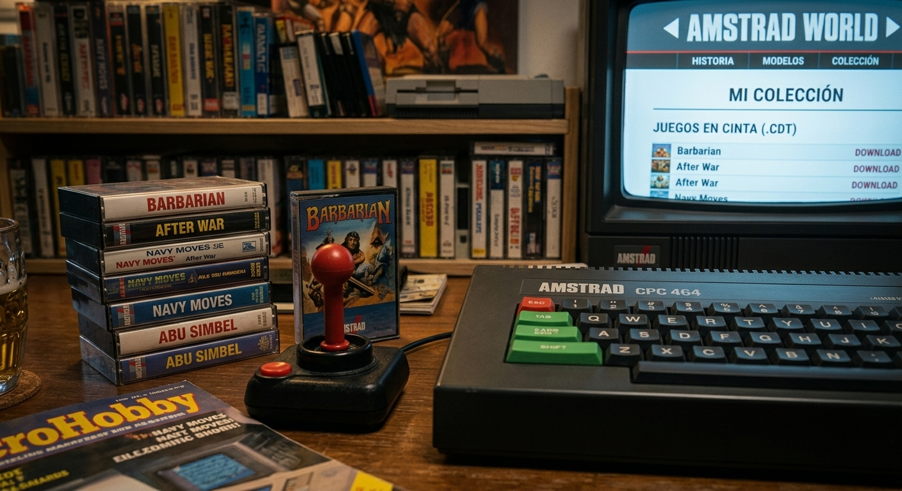

# 🕹️ AMSTRAD WORLD — Versión 2.1

🌐 **Sitio Web Oficial:** [https://nomar2.github.io/amstrad/](https://nomar2.github.io/amstrad/)

---

> **10 REM -------------------------------------------------------------**  
> **20 REM AMSTRAD WORLD — Preservación, Pokes y Cargas Rápidas Z80**  
> **30 REM -------------------------------------------------------------**  

---

Bienvenido a **Amstrad World**. Esta web nació como un proyecto personal para documentar y compartir todo lo relacionado con el universo **Amstrad CPC (464, 664 y 6128)**: su historia, sus modelos, sus juegos más icónicos y, especialmente, la **cultura de los pokes** que tantas horas de juego regaló a quienes crecimos con estas máquinas de 8 bits.

---

## 🚀 ¿Qué encontrarás en este repositorio y en la web?

* 📼 **Colección de juegos pokeados en cinta:** Archivos de juego modificados con vida infinita, munición y trucos.
* ⚡ **Cargas de cinta optimizadas:** Ajustes y rutinas de carga en ensamblador Z80 diseñadas para funcionar en **hardware real**, logrando tiempos de carga sensiblemente más rápidos y estables.
* 💾 **Hardware real y emulación:** Pruebas de compatibilidad verificadas tanto en máquinas físicas como en emuladores (RetroVirtualMachine, ACE, CPCce, etc.).

---

## 🎯 Filosofía del Proyecto

El objetivo no es ser una enciclopedia exhaustiva (para eso ya contamos con grandes referencias como *CPCWiki*), sino un espacio más **personal, práctico y vivido**:

* 🛠️ **Verificación manual:** Todo el contenido está escrito y comprobado. Los pokes y las cargas han sido probados minuciosamente.
* 💾 **Pasión por el formato físico:** Anécdotas de quien realmente usó estos ordenadores y conserva sus cassettes en cajas de plástico transparente.

---

## 🤝 Contribuciones y Contacto

Si encuentras algún error, quieres sugerir pokes para un juego específico o deseas aportar alguna rutina o mejora:

1. Abre un **Issue** o envía un **Pull Request** directamente en este repositorio.
2. Ponte en contacto a través de la sección de contacto en [Amstrad World](https://nomar2.github.io/amstrad/).

---

*Amstrad CPC es una marca registrada de Amstrad Ltd. Proyecto de preservación sin ánimo de lucro.*
